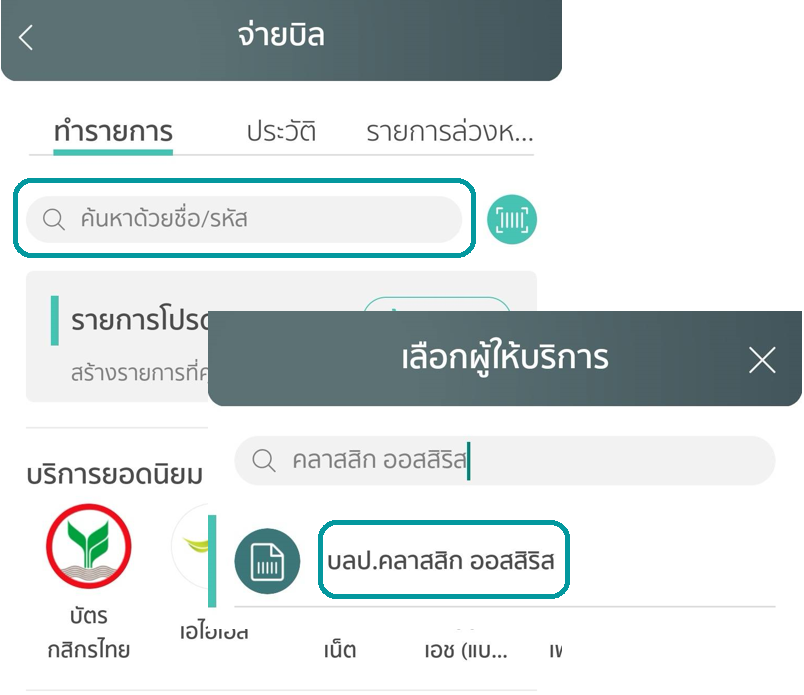

# วิธี ฝากเงินเข้าพอร์ต CAF (Bill-payment)

1. เข้า App ธนาคาร

2. เลือกเมนูจ่ายบิล (bill-Payment)

3. กรอก “Classic Ausiris” หรือ “คลาสสิก ออสสิริส” เพื่อหาบริษัท

    !!! warning "หากมีหลายบัญชี เลือกบัญชีที่ลงท้ายด้วย 701"

4. กรอกข้อมูล

    !!! info "Reference"
        Ref: 1 เลขพอร์ต 7 หลัก (MT4 ตัด 63 ออก)

        Ref: 2 เลขบัตรประชาชน 13 หลัก

5. ยืนยันการทำรายการ

6. เมื่อทำรายการเสร็จ รบกวนส่งสลิปแจ้งใน LINE CAF-So หรือ แจ้งฝากเงินผ่านหน้าเว็บ [CAF](https://www.caf.co.th/)

## ตัวอย่าง

#### 1. เข้า App ธนาคาร

#### 2. เลือกเมนูจ่ายบิล (bill-Payment)

{width="350"}

#### 3. กรอก “Classic Ausiris” หรือ “คลาสสิก ออสสิริส” เพื่อหาบริษัท 

!!! warning "หากมีหลายบัญชี เลือกบัญชีที่ลงท้ายด้วย 701"

{width="350"}

#### 4. กรอกข้อมูล

!!! info "Reference"
    Ref: 1 เลขพอร์ต 7 หลัก (MT4 ตัด 63 ออก)

    Ref: 2 เลขบัตรประชาชน 13 หลัก

{width="350"}

#### 5. ยืนยันการทำรายการ

{width="350"}

#### 6. เมื่อทำรายการเสร็จ รบกวนส่งสลิปแจ้งใน LINE CAF-So หรือ แจ้งฝากเงินผ่านหน้าเว็บ [> CAF <](https://www.caf.co.th/)
---