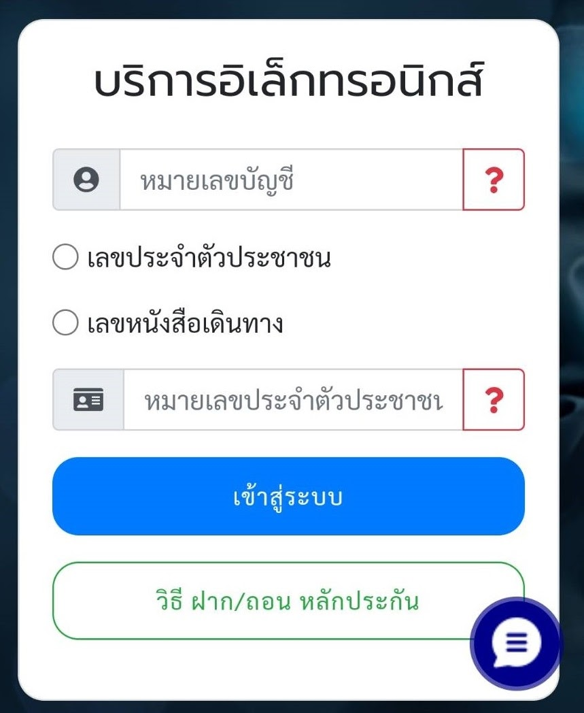
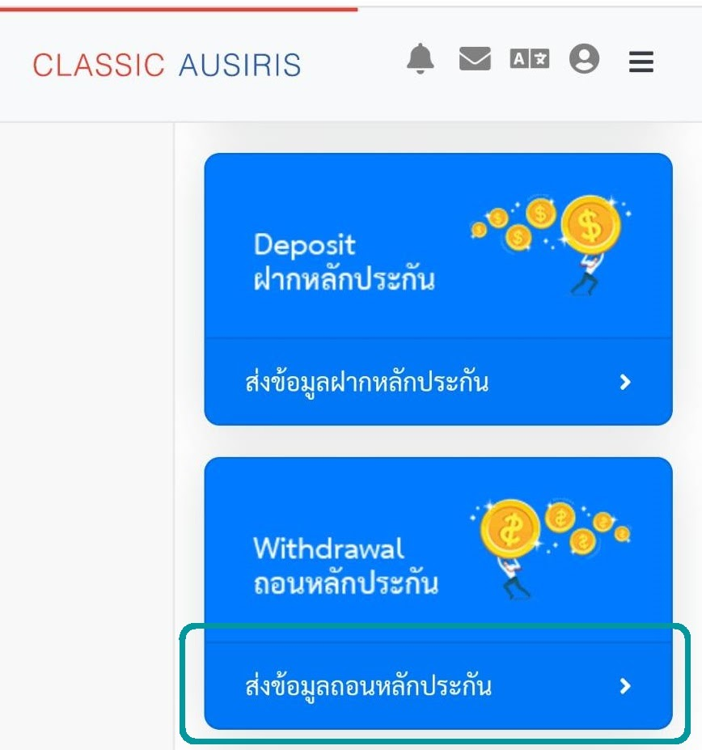
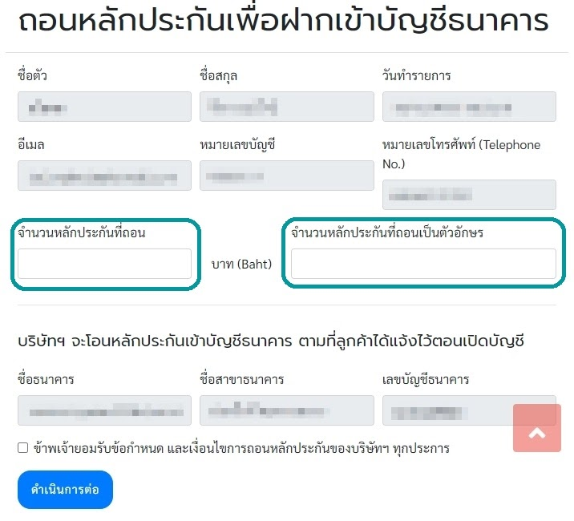

# วิธีแจ้ง ถอนเงิน ผ่านหน้าเว็บ CAF
1. เข้าเว็บ [CAF](https://www.caf.co.th/)

2. เลือกเมนู ฝาก/ถอน (มุมขวาบน)

    !!! info "Login"
        Uesrname: เลขพอร์ต 7 หลัก (MT4 ตัด 63 ออก)

        Password: เลขบัตรประชาชน 13 หลัก

3. เลือกเมนู ถอนหลักประกัน

4. กรอกข้อมูล และ กดยืนยัน

5. เมื่อทำรายการเสร็จหน้าเว็บจะขึ้นว่า

    !!! success "ดำเนินการเรียบร้อย"

## ตัวอย่าง

#### 1. เข้าเว็บ [CAF](https://www.caf.co.th/)

#### 2. เลือกเมนู ฝาก/ถอน (มุมขวาบน)

{width="350"}

{width="350"}

#### 3. เลือกเมนู ถอนหลักประกัน

{width="350"}

#### 4. กรอกข้อมูล และ กดยืนยัน

{width="350"}

#### 5. เมื่อทำรายการเสร็จหน้าเว็บจะขึ้นว่า

!!! success "ดำเนินการเรียบร้อย""
---